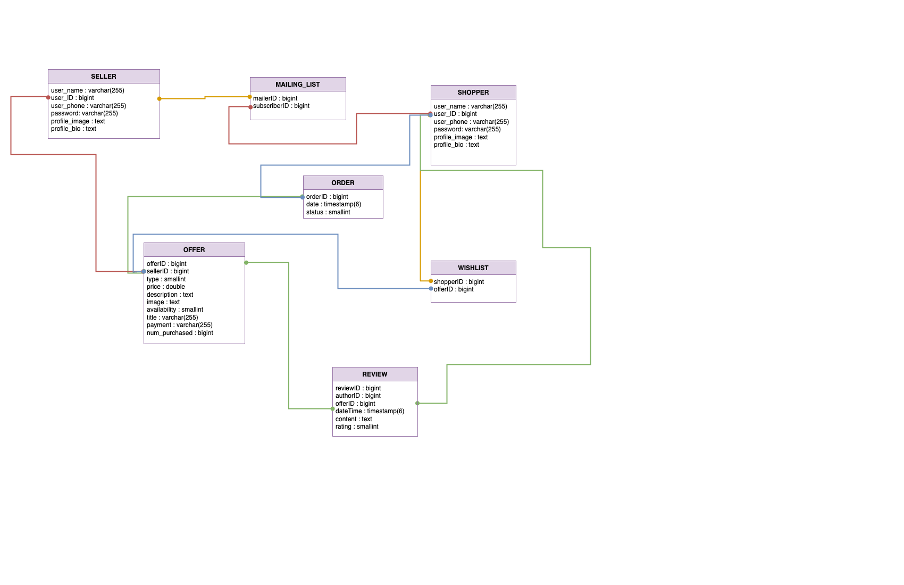

# Spartan's List - Software Design 

Version 0.2  
Prepared by Sage Zhang\
Spartan's List\
Oct 21, 2025

Table of Contents
=================
* [Revision History](#revision-history)
* 1 [Product Overview](#1-product-overview)
* 2 [Use Cases](#2-use-cases)
  * 2.1 [Use Case Model](#21-use-case-model)
  * 2.2 [Use Case Descriptions](#22-use-case-descriptions)
    * 2.2.1 [Actor: Seller](#221-actor-seller)
    * 2.2.2 [Actor: Shopper](#222-actor-shopper) 
* 3 [UML Class Diagram](#3-uml-class-diagram)
* 4 [Database Schema](#4-database-schema)

## Revision History
| Name | Date    | Reason For Changes  | Version   |
| ---- | ------- | ------------------- | --------- |
|  SZ  |10/20    | Initial Design      |    0.1    |
|  SZ  |10/21    | Shopper Desc.       |    0.2    |
|  WG  |10/21    |  Seller Use Cases   |    0.3   |

## 1. Product Overview
Spartan's List is a website not unlike Craigslist, where users can advertise goods and services for sale, and contact the individuals who list them.

## 2. Use Cases
### 2.1 Use Case Model

### 2.2 Use Case Descriptions

#### 2.2.1 Actor: Seller
##### 2.2.1.1 Sign Up
A Seller can sign up using a username and password. The username must be unique.
##### 2.2.1.2 Log In
A Seller shall be able to sign in using their registered email and password. After logging in, the Seller shall be directed their dashboard where they see an overview of their posted offers.
##### 2.2.1.3 Update Profile
A Seller shall be to update their profile by going to their profile page. They can change their email, password, featured reviews, and featured offers.
##### 2.2.1.4 Create Offers
The Seller shall be able to create a new Offer. They would provide a offer title, descriptoin, availability, type, payment method, and price. This Offer will be created to be associated with only this Seller.
##### 2.2.1.4 View Customer Stats
A Seller shall be able to view several statistics such as average rating, purchases this month, subscriber count, and account age.
##### 2.2.1.5 Respond to Orders
A Seller shall be able to respond to orders from Shoppers. They shall be able to accept or deny any offer.
##### 2.2.1.6 Reply To Reviews
A Seller shall be able to reply to reviews associated with their Offers.

#### 2.2.2 Actor: Shopper
##### 2.2.2.1 Sign Up
A Shopper can sign up using a username and password. The username must be unique.
##### 2.2.2.2 Log In
A Shopper can log in using username and password. They will them be redirected to the shopper homepage. 
##### 2.2.2.3 Edit Profile
A Shopper can edit their profile, including their profile picutre, bio, phone number, username, and password.
##### 2.2.1.4 View Offer
A Shopper can view offers made by Sellers on the Shopper home page. 
##### 2.2.1.5 View Seller Data
A Shopper can view Seller data such as their rating and bio on an offer's detail page.
##### 2.2.1.6 Request Offer
A Shopper can request to purchase an offer on an offer's respective detail page. This will then notify the Seller that the Shopper wishes to purchase the item.
##### 2.2.1.7 Write Review
A Shopper can write a review for an offer after they purchase it. The review will be publically listed on the offer's detail page.
##### 2.2.1.8 Follow Seller
A Shopper can follow a Seller. This will add the Shopper to the Seller's amialing list, which will notify the Shopper of any new products or services the Shopper makes in the future. 

## 3. UML Class Diagram

## 4. Database Schema

